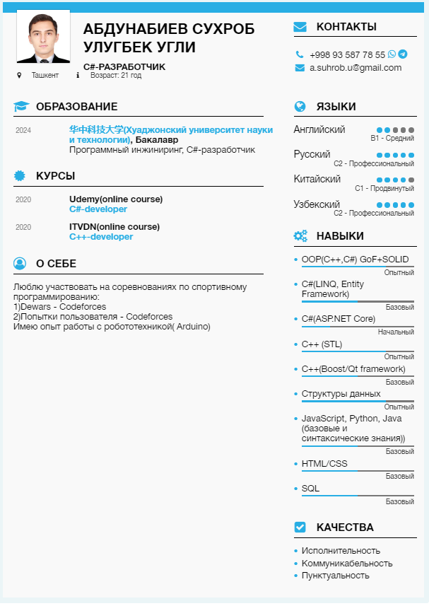

# Suhrob Abdunabiev
*Junior software engnieer and frontend developer*

## Personal info
**First name** : *Sukhrob*
**Second name**: *Abdunabiev*
**Date of birth** : *12.06.2000*
**Marital status** : *single*

|  Contacts | Type  | Value  |
| :------------: | :------------: | :------------: |
|1| Email | a.suhrob.u@gmail.com |
|2| Telephone number  | +998 93 5877855  |
|3| Telegram  | @asuhr0b  |
|4| Whatsup  | +998 93 5877855  |
|5| Discord (rs-school) |  Suhrob (@a-suht0b-u) |
|6| Wechat | a_suhrob_u|
|7| Codeforces | dewars |

### Profile
>Hello, my name is Sukhrob Abdunabiyev, today I am a student at the school of "software engineering" at the University of China. I am interested from school in various aspects of programming, such as robotics (Arduino), writing algorithms (C++) and creating applications (js[React,Node], C++) and others. In order to always meet the advanced standard and requirements, I am not delving into modern technology and new aspects of modern programming languages, as I consider it necessary to become a competitive specialist. Currently, I work as a frontend developer in a marketing company (create different information sites for customers, such as landing pages, etc.).I can also say that I am highly motivated and deformed.
***P.S. I am ready to do my utmost to pass this selection and become your partner.***

## Education Background
### Education
| №  | Name  | From | To  | Major  | Country |
| :------------: | :------------: | :------------: | :------------: | :------------: | :------------: |
| 1 | Huazhong university of science and technology  | 2019  | now  | Software engineering | China  |
| 2 | Professional Collage of Inforamtion Technologies of Tashkent | 2016 | 2019 | Computer engineering | Tashkent |

### Language skills
| №  | Language  | Level  | Skills  | Details  |
| :------------: | :------------: | :------------: | :------------: | :------------: |
| 1  | Uzbek  | Native  | fluency in all aspects of the language  | use it for communication and study, especially school  |
| 2  | Russian  | Native  | fluency in all aspects of the language  | use it for communication and study, especially school  |
| 3  | English  |  B1-B2  | fluency in reading, listening, writing  | use it for communication and study up to now  |
| 4 | Chinese |  HSK 4-5 | very good command | mainly use it for communication and study in China | 

## Professional skills
### Programming languages
| №  | Language  | Level of native (standardized/built-in) aspects | Experience | Use for | Frameworks   |
| :------------: | :------------: | :------------: | :------------: | :------------: | :------------: |
| 1  | js  | good  | 1.5+ years  | web, algorithms, apps |1.React(strong-mid)  2.Node.js+Express.js (strong-basic) 3.React(strong-mid)  |
| 2  |  C++ | middle  | 1.5+ years  | algorithms  | Qt (basic)  |
| 3 | Python  | middle  | 1.5 years  |  allgorithms | -  |
| 4 | C#  | middle  | 1 year  | study OOP  |  1.LINQ 2.Entity Framework |
| 5 | Java  | basic  | 1 year  | study OOP  | - |

### Front-end technologies
| №  | Technology  | Level  | Details  |
| :------------: | :------------: | :------------: | :------------: |
| 1 | HTML5  | good  | Mainly use all modern html tags and concepts  |
| 2 | CSS3  | good  | Grid, Flex, modern CSS UI etc   |

### Database Skills
| №  | Technology  | Level |Use with  | Details  |
| :------------: | :------------: | :------------: | :------------: |
| 1 |  MobgoDB  |  strong-basic - middle |  Node.js(Express.js)  |  Also basicly know Mongoose|
| 2 |  SQL (Oracle)  |  strong-basic |  -  |  Query, Join, Union etc.  |
###Technical Skills
- Rich expirience of using PC
- Using OS : Windows, Linux (Ubuntu)
- Arduino
- Assembly (basics)
- Algorithms and Data Structure
- OOP patterns (GoF)